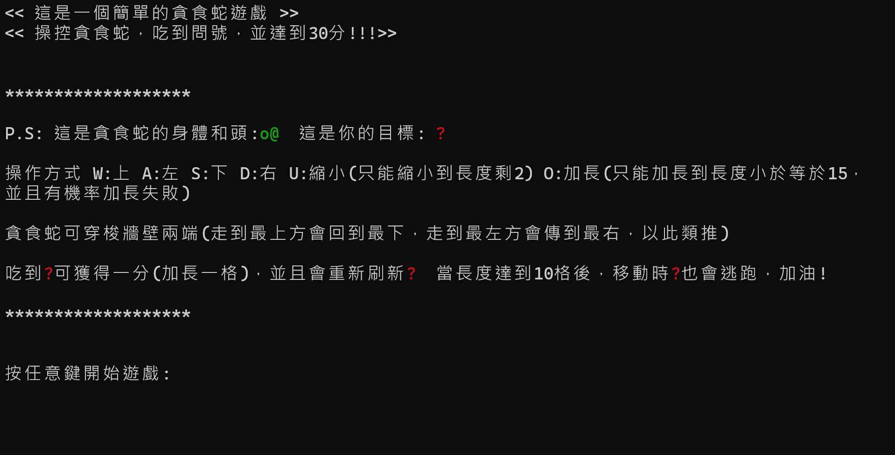
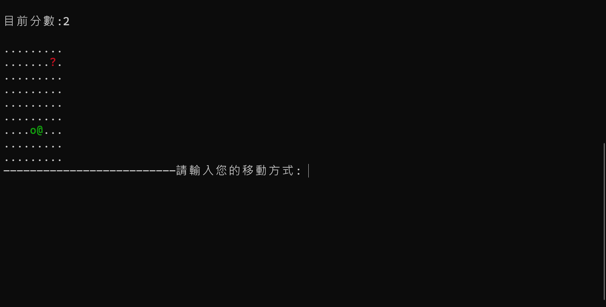

# 貪吃蛇遊戲專案
## 功能說明 
### 操作方式：  
   玩家使用 **WASD** 鍵（上下左右）操控貪食蛇（不能倒車），並且邊界會互通
   (到最左方會回到最右邊，到最上方會回到最下面，反之亦然)。
### 遊戲目標與玩法：  
   畫面中會出現一個 **？**(圖一)當蛇頭碰到它時，蛇的身體會加長一格，同時 **？**(圖一)會重新刷新到新的位置。  
   遊戲的目標是將蛇的身體長度（分數）最終加長至 **30**。  
   當身體長度達到 **10** 之後，隨著貪食蛇移動，？(圖一)也會開始逃跑（但不能穿牆），且逃跑方向為可移動的隨機方向，  
   因此玩家需要運用策略才能成功捕捉到？(圖一)

### 失敗條件：  
   如果蛇頭 **@**(圖二)碰到了自己的身體，遊戲就結束。

### 額外功能：  
   **U 鍵：** 可從尾巴縮小一格（當長度大於 2 時使用），適用於當你將自己困住時。  
   **O 鍵：** 可使尾巴往隨機方向加長一格，但如果尾巴被圍住時則會加長失敗，且最多加長至 **15** 格。  
   此功能適用於已熟悉基本操作的玩家，可快速開始遊戲。

### 注意事項：  
   **請勿持續按壓同一鍵，可能造成閃退!!!**  
   遊玩時需切換至 **英文輸入法！**  
   放大畫面（Ctrl + 滾輪）可獲得更佳遊戲體驗。  
   
### 圖片：  
圖一   

圖二   

開始介面   

運行介面   

   
